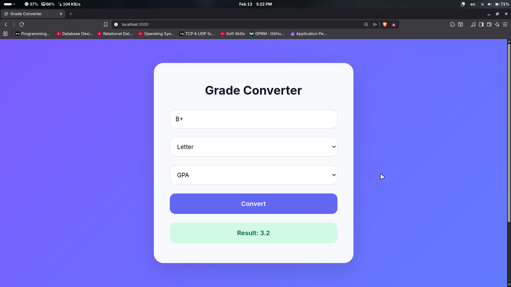

# Grade Conversion API

A simple backend project built with **Spring Boot** that exposes a single REST endpoint for converting grades between different grading systems.

The frontend is a minimal static interface created only to demonstrate API interaction.  
The focus of this project is backend implementation and containerization.

---

## 📸 Preview

---

## 🎯 Purpose

This project demonstrates:

- REST API development using Spring Boot
- Controller–Service structure
- Input validation & JSON request handling
- Docker multi-stage build
- Reverse proxy configuration using Nginx
- Service separation via Docker Compose

The application intentionally contains only **one API endpoint**.

---

## 🛠 Tech Stack

**Backend**
- Java 21
- Spring Boot
- Maven

**Infrastructure**
- Docker
- Docker Compose
- Nginx

**Frontend (minimal demo UI)**
- HTML
- CSS
- JavaScript

---

## 📡 API Documentation

### Endpoints

- POST /api/convert

---

## 📂 Project Structure

~~~markdown
Grades-Conversion/
│
├── backend/
│   ├── src/
│   ├── pom.xml
│   └── Dockerfile
│
├── frontend/
│   ├── static/
│   ├── nginx.conf
│   └── Dockerfile
│
├── docs/
│   └── app-preview.png
│
├── docker-compose.yaml
└── README.md
~~~

---

## 🚀 Running Locally

### Clone the repository:
~~~bash
git clone https://github.com/mahmoud2617/Grades-Conversion.git
cd grade-conversion
~~~

### Run Backend Only (Without Docker):
~~~bash
cd Grades-Conversion/backend
mvn spring-boot:run
~~~

**Backend runs on:** `http://localhost:8080`

### Run Full Application (Docker):
From the project root:
~~~bash
docker compose up --build
~~~

**Frontend runs on:** `http://localhost:3000`

To stop:
~~~bash
docker compose down
~~~

---

## 📌 Notes

- The backend contains only one REST endpoint.
- The frontend exists solely to demonstrate API consumption.
- The project is not deployed and runs locally.

---

## 👤 Author

**Mahmoud Mohammed**  
**LinkedIn:** https://linkedin.com/in/mahmoud2617
